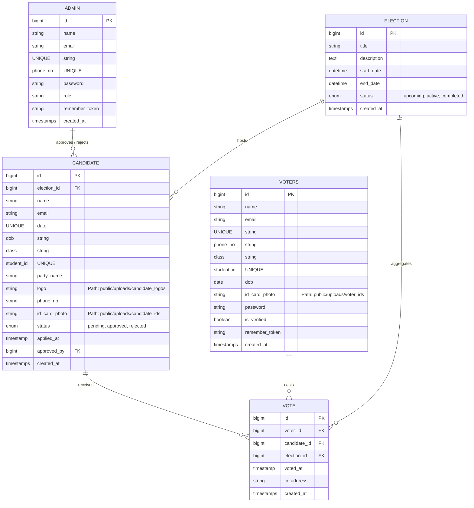

# 🗳️ University Student Union E-Voting System

[](https://laravel.com)
[](https://php.net)
[](https://mysql.com)
[![Tailwind CSS] @vite(['resources/css/app.css', 'resources/js/app.js'])](https://tailwindcss.com)
[](LICENSE)

> A modern, secure, and fully responsive **University Student Union Electoral Platform** built with **Laravel 12**, **MySQL**, **Tailwind CSS**, and **SweetAlert2**. Designed for digital election management, candidate nominations, voter authentication, and fraud-proof online ballot casting.

---

## 🌟 Key Features

### 🛡️ Administrative Portal & Authentication
* **Admin Registration & Login System**: Dedicated `admin` authentication guard using custom session state, bcrypt password hashing, and role-based permissions.
* **Dashboard Analytics**: Real-time stats counting registered voters, candidate applications, active elections, and total votes cast.
* **Candidate Approval Workflow**: Review student candidate applications, verify ID proof photos, inspect party logos, and approve/reject nominations.
* **Voter Verification**: Manage student voter registrations and toggle verification flags.

### 🎓 Candidate Application Portal
* **Online Nomination Form**: Students can apply for ongoing student union elections.
* **File Management**: Direct public file storage for Student ID Card Photos (`public/uploads/candidate_ids`) and Political Party Logos (`public/uploads/candidate_logos`).
* **Application Tracking**: Status feedback for pending, approved, or rejected applications.

### 🗳️ Student Voter Portal & Voting Booth
* **Secure Voter Authentication**: Separate `voter` session guard for verified student login and registration.
* **1-Voter 1-Vote Constraint**: Database-enforced unique indexes on `(voter_id, election_id)` ensuring a student cannot vote more than once in the same election.
* **Audit Trail**: Real-time timestamping (`voted_at`) and IP address logging for anti-fraud audits.

---

## 📐 Database Schema & Entity-Relationship Diagram (ERD)



---

## 🛠️ Technology Stack

| Layer | Technologies Used |
| :--- | :--- |
| **Backend Framework** | Laravel 12 (PHP 8.2+) |
| **Database** | MySQL 8.0 |
| **Authentication** | Multi-Guard Authentication (`admin`, `voter`, `web`) |
| **Frontend Styling** | Tailwind CSS & Custom CSS Micro-animations |
| **Icons & Alerts** | FontAwesome 6, SweetAlert2 |
| **Asset Storage** | Local Public Storage (`public/uploads/`) |

---

## 🚀 Installation & MySQL Configuration

### 1. Prerequisites
Ensure you have installed:
* **PHP** >= 8.2 (with OpenSSL, PDO, Mbstring, Ctype extensions)
* **Composer** >= 2.x
* **MySQL Server** (via XAMPP)

### 2. Clone the Repository
```bash
git clone https://github.com/your-username/university-voting-system.git
cd university-voting-system
```

### 3. Install Dependencies
```bash
composer install
npm install
```

### 4. Configure Environment (`.env`)
Copy the environment template and update your database credentials:

```bash
cp .env.example .env
```

Open `.env` and set your MySQL configuration:
```env
APP_NAME="University Voting System"
APP_URL=http://127.0.0.1:8000

DB_CONNECTION=mysql
DB_HOST=127.0.0.1
DB_PORT=3306
DB_DATABASE=university_voting_system
DB_USERNAME=root
DB_PASSWORD=
```

> **Note**: Create the database `university_voting_system` in your MySQL engine (e.g. via phpMyAdmin or MySQL CLI) before running migrations.

### 5. Generate Application Key & Run Migrations
```bash
php artisan key:generate
php artisan migrate --seed
```

The database seeder creates a default administrator account:
* **Admin Email**: `admin@university.edu`
* **Admin Password**: `password123`

### 6. Create Required Upload Folders
```bash
mkdir -p public/uploads/candidate_logos
mkdir -p public/uploads/candidate_ids
mkdir -p public/uploads/voter_ids
```

### 7. Run Local Development Server
```bash
php artisan serve
```
Access the application at `http://127.0.0.1:8000`.

---

## 🛣️ Application Route Reference

| HTTP Method | Route | Controller & Method | Description |
| :--- | :--- | :--- | :--- |
| `GET` | `/` | `HomeController@index` | Public Landing Page |
| `GET` | `/admin/register` | `AdminAuthController@showRegisterForm` | Admin Registration View |
| `POST` | `/admin/register` | `AdminAuthController@register` | Process Admin Account Creation |
| `GET` | `/admin/login` | `AdminAuthController@showLoginForm` | Admin Login View |
| `POST` | `/admin/login` | `AdminAuthController@login` | Process Admin Login |
| `POST` | `/admin/logout` | `AdminAuthController@logout` | Admin Logout |
| `GET` | `/admin/dashboard` | `DashboardController@index` | Protected Admin Dashboard |
| `GET` | `/candidate/apply` | `CandidateApplicationController@create` | Candidate Application Form |
| `POST` | `/candidate/apply` | `CandidateApplicationController@store` | Submit Nomination Application |
| `GET` | `/voter/login` | `VoterAuthController@showLoginForm` | Voter Login Page |
| `GET` | `/voter/register` | `VoterAuthController@showRegisterForm` | Student Voter Registration |
| `GET` | `/voter/dashboard` | `VotingBoothController@dashboard` | Protected Voter Digital Booth |
| `POST` | `/voter/vote` | `VotingBoothController@castVote` | Cast Encrypted Ballot |

---

## 📂 Project Directory Structure

```
university-voting-system/
├── app/
│   ├── Http/
│   │   ├── Controllers/
│   │   │   ├── Admin/
│   │   │   │   ├── AdminAuthController.php
│   │   │   │   ├── CandidateController.php
│   │   │   │   ├── DashboardController.php
│   │   │   │   ├── ElectionController.php
│   │   │   │   └── VoterController.php
│   │   │   ├── Voter/
│   │   │   │   ├── VoterAuthController.php
│   │   │   │   └── VotingBoothController.php
│   │   │   ├── CandidateApplicationController.php
│   │   │   └── HomeController.php
│   │   └── Middleware/
│   │       ├── AdminMiddleware.php
│   │       └── VoterMiddleware.php
│   └── Models/
│       ├── Admin.php
│       ├── Candidate.php
│       ├── Election.php
│       ├── Vote.php
│       └── Voter.php
├── config/
│   └── auth.php
├── database/
│   ├── migrations/
│   │   ├── 2026_01_01_000001_create_admins_table.php
│   │   ├── 2026_01_01_000002_create_elections_table.php
│   │   ├── 2026_01_01_000003_create_candidates_table.php
│   │   ├── 2026_01_01_000004_create_voters_table.php
│   │   └── 2026_01_01_000005_create_votes_table.php
│   └── seeders/
│       ├── AdminSeeder.php
│       └── DatabaseSeeder.php
├── public/
│   └── uploads/
│       ├── candidate_ids/
│       ├── candidate_logos/
│       └── voter_ids/
├── resources/
│   └── views/
│       ├── admin/
│       │   ├── auth/
│       │   │   ├── login.blade.php
│       │   │   └── register.blade.php
│       │   ├── candidates/
│       │   ├── elections/
│       │   ├── voters/
│       │   └── dashboard.blade.php
│       ├── voter/
│       └── layouts/
│           └── app.blade.php
└── routes/
    └── web.php
```

---

## 🔐 Security Features

1. **Bcrypt Password Hashing**: Passwords for both Administrators and Student Voters are hashed with bcrypt.
2. **CSRF Protection**: All form submissions include Laravel CSRF tokens.
3. **Multi-Guard Session Segregation**: Prevents privilege escalation between student voters and administrative users.
4. **Database Audit Constraints**: Prevents double-voting attacks via unique composite indexing `(voter_id, election_id)`.

---

## 📜 License
This project is open-source software licensed under the [MIT License](LICENSE).
